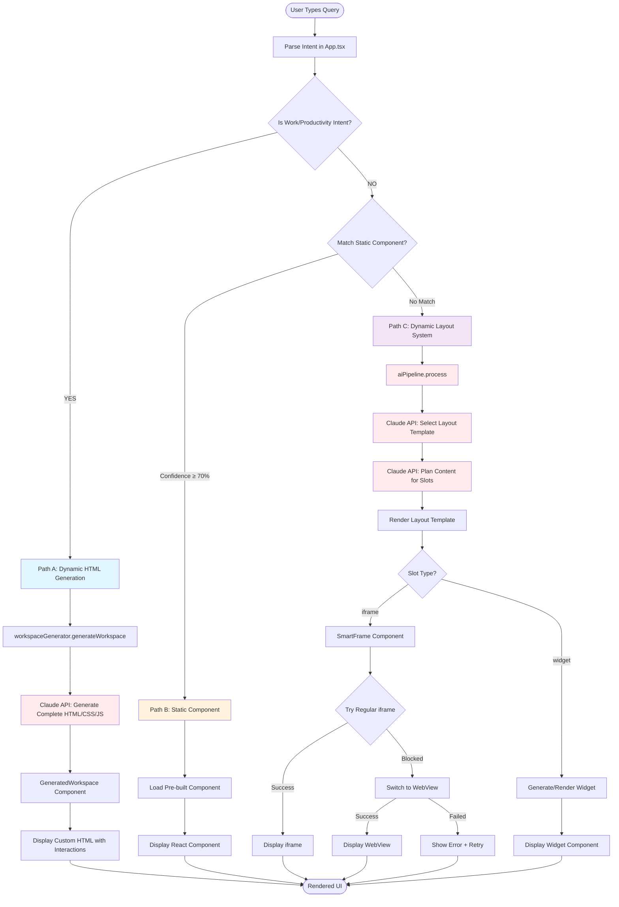

# Query Processing Flow - Nexus Application

## Complete Logic Flowchart



## Detailed Decision Logic

### 1. INITIAL DECISION: Work Intent Detection (App.tsx:56-70)

**Work Intent Keywords:**
- email, research, write, code, plan, analyze
- search, compare, work, task
- gmail, docs, github

```
IF (query contains work keywords) THEN
    → Use Dynamic HTML Generation (Path A)
ELSE
    → Check for Static Component (Path B)
    → OR Use Dynamic Layout System (Path C)
```

### 2. PATH A: Dynamic HTML Generation (Gemini-OS Inspired)

**File Flow:**
```
App.tsx:72-100 
→ DynamicWorkspaceGenerator.ts:generateWorkspace()
→ main.ts:call-claude (workspace_generation)
→ Returns complete HTML/CSS/JS string
→ GeneratedWorkspace.tsx renders it
```

**What Happens:**
1. Send intent to Claude with prompt for full HTML workspace
2. Claude generates complete interactive HTML/CSS/JS
3. HTML is injected and scripts are executed
4. Interaction handlers track user clicks

**Best For:** Complex productivity tasks, custom interfaces

### 3. PATH B: Static Component Matching

**File Flow:**
```
App.tsx:103-137
→ intentMatcher.ts:matchIntent()
→ Returns component name + confidence
→ Loads pre-built React component
```

**Static Components:**
- BTCChart (bitcoin, crypto, btc)
- TokyoTrip (tokyo, japan, trip)
- GraphingCalculator (graph, calculator, math)
- WeatherWidget (weather, forecast)
- PhysicsHomework (physics, homework)

**What Happens:**
1. Fuzzy match against known intents
2. If confidence ≥ 70%, use static component
3. Add artificial loading delay (1-2.3s) for realism
4. Render pre-built React component

### 4. PATH C: Dynamic Layout System

**File Flow:**
```
App.tsx:139-165
→ AIPipeline.ts:process()
→ main.ts:select-layout (Claude picks template)
→ main.ts:plan-content (Claude fills slots)
→ LayoutTemplates.tsx renders chosen layout
→ SmartFrame.tsx handles iframes
```

**Available Layouts:**
- SingleWebsite: Full-screen iframe
- SplitView: Two side-by-side panels  
- Dashboard: Grid of 2-6 widgets
- ListDetail: Sidebar + detail view
- MediaFocus: Large media area
- ComparisonView: Side-by-side comparison
- FeedLayout: Vertical scrolling feed

**What Happens:**
1. Claude selects best layout for intent
2. Claude plans content for each slot (iframe URLs or widget specs)
3. Layout template renders with SmartFrame components
4. SmartFrame tries iframe → falls back to WebView if blocked

## Current Issues & Confusion Points

### 1. **Fragmented Decision Logic**
- Work vs non-work split is arbitrary
- Some queries could work with either approach

### 2. **iframe Blocking Problems**
- Many sites block iframe embedding
- WebView fallback not fully implemented
- Errors visible in console

### 3. **Inconsistent Experience**
- Path A: Full custom HTML
- Path B: Pre-built components
- Path C: Templates with iframes
- User doesn't know which path their query will take

### 4. **Overlap in Capabilities**
- Dynamic HTML could handle everything
- Layout system could handle work tasks
- Decision based on keywords not actual needs

## Data Structures

### RenderedContent Type:
```typescript
{
  id: string
  type: 'static' | 'generated' | 'dynamic' | 'workspace'
  component?: string        // For static
  workspaceHtml?: string    // For workspace
  layout?: string           // For dynamic
  slots?: LayoutSlot[]      // For dynamic
  content: any
  timestamp: number
}
```

### Layout Slot Type:
```typescript
{
  id: string
  type: 'iframe' | 'widget' | 'text' | 'media' | 'custom'
  props: {
    url?: string
    title?: string
    content?: string
    // ... other props
  }
  component?: string  // Generated component code
}
```

## Example Query Flows

### Example 1: "Help me write an email"
1. Contains "email" → Work intent ✓
2. Goes to Path A
3. Claude generates full HTML email interface
4. Renders in GeneratedWorkspace

### Example 2: "Show me bitcoin price"
1. Not work intent ✗
2. Matches "bitcoin" static component ✓
3. Goes to Path B
4. Loads BTCChart component

### Example 3: "League of legends teemo build"
1. Not work intent ✗
2. No static match ✗
3. Goes to Path C
4. Claude selects SplitView layout
5. Claude suggests op.gg, u.gg URLs
6. SmartFrame tries iframes → they fail
7. Should fallback to WebView (currently broken)

### Example 4: "Stock market dashboard"
1. Not work intent ✗ (no work keywords)
2. No static match ✗
3. Goes to Path C
4. Claude selects Dashboard layout
5. Claude suggests finance.yahoo.com URLs
6. iframes get blocked
7. Shows errors in console