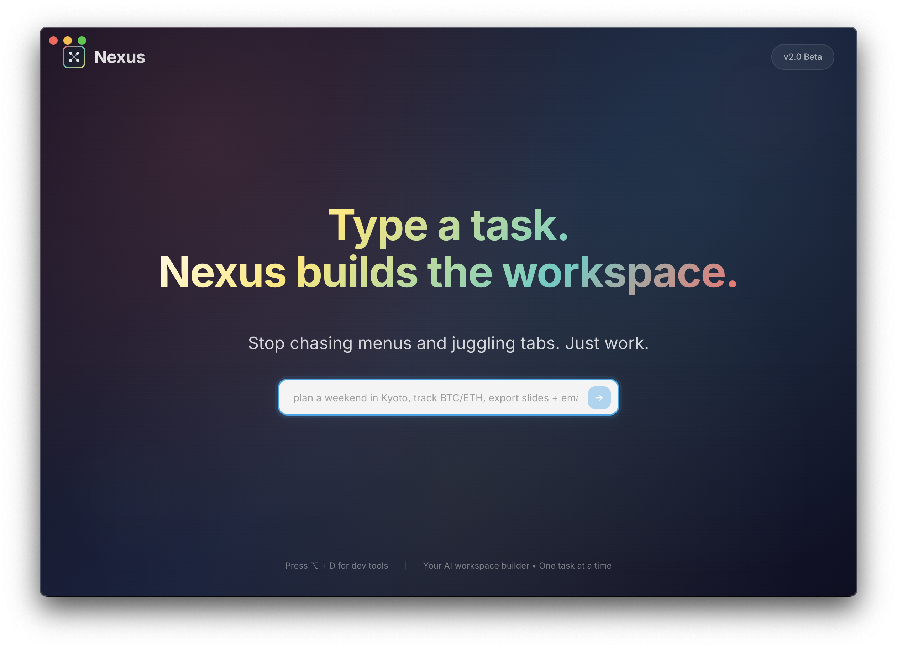
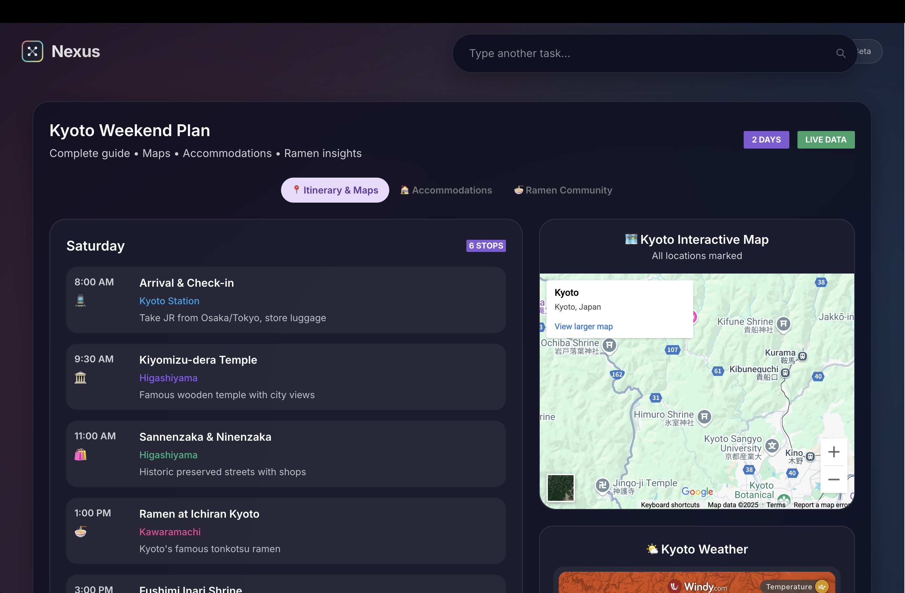
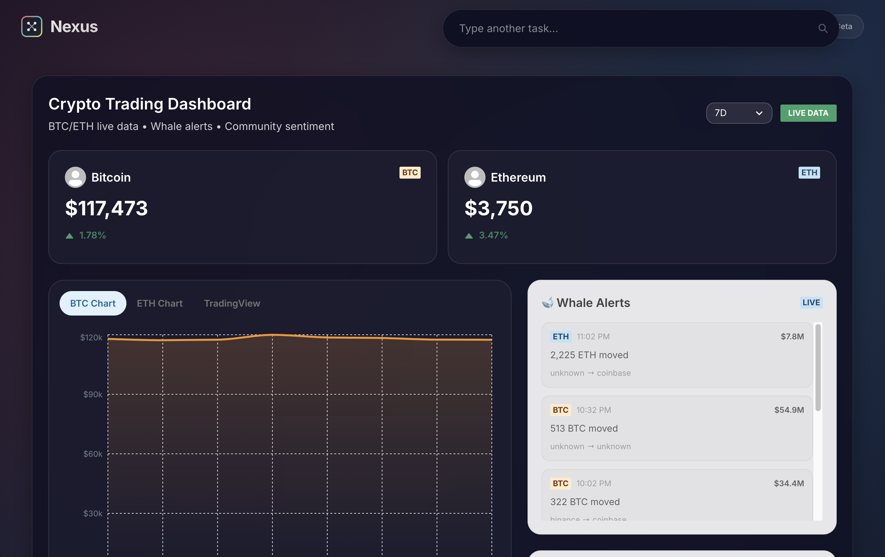
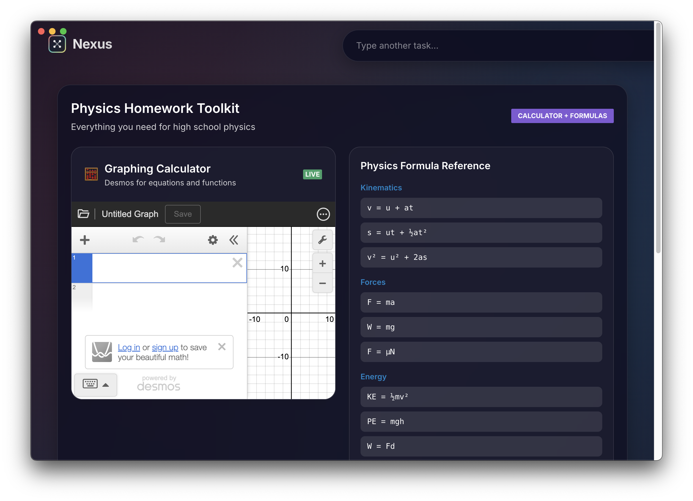
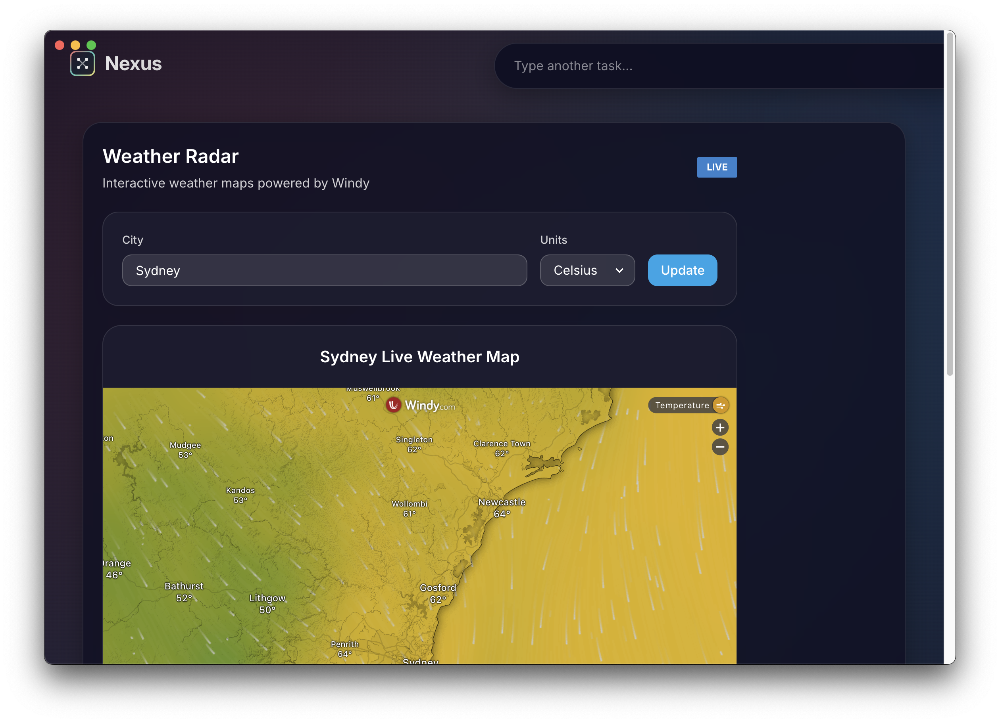

<div align="center">
  
# 🌟 Nexus

### ✨ Type a task, Nexus builds the workspace ✨

> ⚠️ **Work in Progress**: This project is under active development. Features may change and bugs may exist.

[](https://reactjs.org/)
[](https://anthropic.com/)
[](https://www.typescriptlang.org/)
[](https://www.electronjs.org/)

*A desktop command bar that turns any job-to-be-done into an instant, single-window workspace*

[🚀 Features](#-features) • [📸 Demo](#-demo) • [⚡ Quick Start](#-quick-start) • [🛠️ Tech Stack](#️-tech-stack) • [🤝 Contributing](#-contributing)

</div>

---

## 🎯 What is Nexus?

**Nexus** is a desktop command bar that turns any job-to-be-done—"plan a weekend in Kyoto," "track BTC/ETH," "export slides + email Alice"—into an instant, single-window workspace. It embeds the right web apps, pre-filters them, and remembers your layout so you stop chasing menus and juggling tabs.

<div align="center">
  
  <p><i>Type. Generate. Use. It's that simple.</i></p>
</div>

## 🚀 Features

<table>
<tr>
<td width="50%">

### 🎨 Instant Workspace Creation
Type any task and get a perfectly configured workspace in seconds

### 🧠 Smart App Selection
AI understands your task and embeds the right web apps automatically

### 🖥️ Single-Window Focus
All your tools in one place - no more tab juggling or window chaos

</td>
<td width="50%">

### ⚡ Pre-Filtered Content
Apps open with the right context - search results, specific pages, relevant data

### 🎯 Layout Memory
Nexus remembers how you like your tools arranged for each type of task

### 🔧 Stop Menu Hunting
Direct access to what you need - no navigating through endless menus

</td>
</tr>
</table>

## 📸 Demo

### ✨ See the Magic in Action

<div align="center">
  <table>
    <tr>
      <td align="center">
        
        <br />
        <b>✈️ "plan a weekend in Kyoto"</b>
        <br />
        <i>Complete itinerary with maps & weather</i>
      </td>
      <td align="center">
        
        <br />
        <b>💰 "track BTC/ETH"</b>
        <br />
        <i>Live crypto data with whale alerts</i>
      </td>
    </tr>
    <tr>
      <td align="center">
        
        <br />
        <b>📐 "physics homework"</b>
        <br />
        <i>Calculator + formulas for high school physics</i>
      </td>
      <td align="center">
        
        <br />
        <b>🌤️ "weather in Sydney"</b>
        <br />
        <i>Live weather radar powered by Windy</i>
      </td>
    </tr>
  </table>
</div>

## ⚡ Quick Start

### Prerequisites
- Node.js 16+ 
- npm or yarn
- Anthropic API key ([Get one here](https://console.anthropic.com/))

### 🚀 Installation

```bash
# Clone the magic ✨
git clone https://github.com/victorhuangwq/nexus.git
cd nexus

# Install dependencies 📦
npm install

# Set up your API key 🔑
cp .env.example .env
# Edit .env and add: ANTHROPIC_API_KEY=your_key_here

# Launch Nexus! 🎉
npm run dev
```

## 📚 Documentation

### 🎮 Development Commands

```bash
npm run dev          # 🚀 Start development server
npm run build        # 📦 Build for production
npm test             # 🧪 Run test suite
npm run lint         # 🔍 Lint codebase
npm run preview      # 👀 Preview production build
```

### 🏗️ Project Structure

```
nexus/
├── 📂 src/
│   ├── 🎨 components/    # React components
│   ├── 🧠 services/      # AI & business logic
│   ├── 🎯 hooks/         # Custom React hooks
│   └── 🖥️ main/          # Electron main process
├── 📂 public/            # Static assets
├── 📂 tests/             # Test files
└── 📄 package.json       # Project config
```

## 🤝 Contributing

We love contributions! Whether it's bug fixes, new features, or documentation improvements.

1. Fork the repo
2. Create your feature branch (`git checkout -b feature/AmazingFeature`)
3. Commit your changes (`git commit -m 'Add some AmazingFeature'`)
4. Push to the branch (`git push origin feature/AmazingFeature`)
5. Open a Pull Request

## 📝 License

This project is licensed under the MIT License - see the [LICENSE](LICENSE) file for details.

---

<div align="center">
  
### 🌟 Star us on GitHub!

Made with ❤️ by [Victor Huang](https://github.com/victorhuangwq)

[⬆ back to top](#-nexus)

</div>